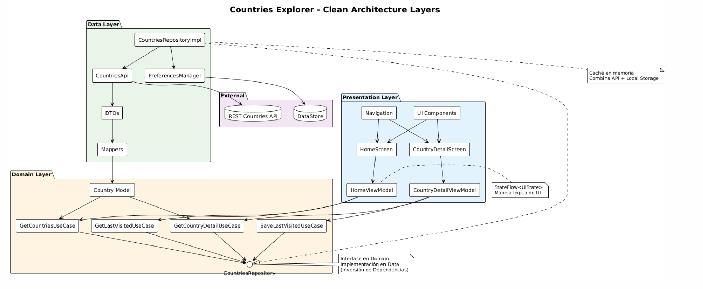
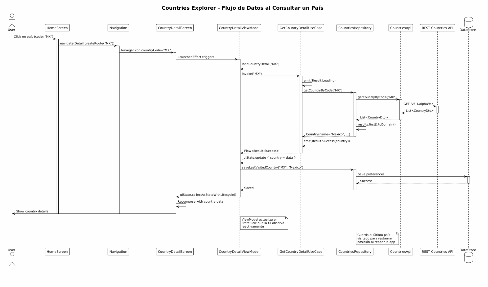

# Exam Countries Explorer App 🌍

Aplicación móvil Android para explorar información de países del mundo.

---

##  Información del Estudiante

- **Nombre Completo:** Horacio Villela Hernandez
- **Matrícula:** A01712206
- **Plataforma:** Android
- **Tecnologías:** Kotlin, Jetpack Compose, MVVM, Clean Architecture

---

## = Descripción 

Esta es una aplicación educativa que permite consultar información sobre países del mundo, incluyendo:

-  **Población y región**
-  **Idiomas oficiales**
-  **Moneda**
-  **Capital**
-  **Área territorial**
-  **Zonas horarias**
-  **Países fronterizos**

---

##  Características Principales

### 1. **Listado de Países**
- Lista completa obtenida desde [REST Countries API](https://restcountries.com)
- Tarjetas con bandera, nombre y región

### 2. **Detalle del País**
- Información del país a elegirt
- Vista organizada
- Guardado del último país visitado
- Animaciones 

### 3. **Búsqueda**
- Búsqueda por nombre 

### 4. **Manejo de Estados**
- Loading state con shimmer effect
- Error state con mensaje descriptivo y botón de reintentar
- Success state con datos completos

### 6. **Self-Explained Dialog**
- Botón de información en la pantalla principal
- Explicación de arquitectura, persistencia y búsqueda

---

##  Arquitectura

### **MVVM + Clean Architecture**

El proyecto está organizado en 3 capas principales:

#### **1. Presentation Layer (UI)**

#### **2. Domain Layer (Lógica de Negocio)**

#### **3. Data Layer (Datos)**

## 📐 Diagramas de Componentes

### Diagrama 1: Arquitectura de Capas

Ver código PlantUML: [architecture-diagram.puml](docs/architecture-diagram.puml)

### Diagrama 2: Flujo de Datos

Ver código PlantUML: [data-flow-diagram.puml](docs/Flow-diagram.png.puml)

---

## 🚀 Instalación y Ejecución

### Requisitos Previos
- Android Studio
- Dispositivo Android/Emulador 

### Pasos
1. Clona el repositorio:

2. Abre el proyecto en Android Studio

3. Sync Gradle

4. Ejecuta la app:
- Conecta un dispositivo o inicia un emulador
- Click en Run 

---

##  Metodología de Desarrollo Ágil

### Introducción

Durante el desarrollo aplique principios de metodología ágil, específicamente adaptando la metodologia Scrum a un proyecto individual, logrando alinear las etapas de desarrollo de software con la metodología.

### Etapas de Desarrollo con Scrum

#### 1. Análisis de Requerimientos

**Actividades Realizadas:**
- Leí los requerimientos del examen
- Identifiqué las historias de usuario como:
  - quiero ver una lista de países
  - quiero buscar países por nombre o código
  - quiero ver detalles completos de un país
  - quiero que la app recuerde el último país que visité
- Me mfique en fnciones concretas paso a paso: primero la lista, luego el detalle, después la búsqueda

 Esta etapa fue horrible pues dedibo al inconveniente de mi enfermedad. Tener claro qué debía entregar fue muy dificil y cometi errores tanto en la elección de priridades como en el código.

#### 2. Diseño Planificación y Desarrollo

**Etapa de Desarrollo:** Diseño de Arquitectura

**Actividades Realizadas:**
- Decidí usar Clean Architecture porque ya la conocía del laboratorio de Pokédex
- Elegí Jetpack Compose para UI, Retrofit para API, Hilt para DI
- Diseñé la estructura de paquetes (data, domain, presentation)
- Pense en que casos de uso necesitaba (GetCountries, GetCountryDetail, etc.)

**Etapa de Desarrollo:** Implementación

** Data Layer**
- Creé los DTOs, 
- Hice el mapper de DTO a modelo de dominio

** Domain Layer**
- Definí el modelo Country con sus propiedades
- Creé la interfaz 
- Implementé los Use Cases
- Me di cuenta que necesitaba un caso de uso para guardar preferencias y se me olvido llenarlos la primera vez

** Presentation Layer**
- Desarrolle HomeScreen con la lista de países
- Cree CountryDetailScreen
- Implementé los componentes visuales
- Conecté con el ViewModel
- Agregué animaciones

**Reflexión:** Ir por capas me funcionó bien pero me costo cpro mucho. Las primeras iteraciones la ser en el salón lograron confundirme, como ejemplo en CountryDetailUiState agrege el codigo correspondiente de CountryDetailScreem, perdiendo por lo menos 1 hora buscando el error que tenia de, luego me enfoqué en cabar la UI. 

#### 4. Testing y Depuración

**Etapa de Desarrollo:** Pruebas y Corrección de Errores

**Actividades Realizadas:**

- Identifiqué problemas antes y despues de correr la app:
  - Error de imports 
  - Problema con collectAsStateWithLifecycle
  - la API devolvía un array, no  un objeto
  - Archivos vacíos que causaban errores de compilación

**Reflexión:** Los errores fueron frustrantes y no muy educativos. El más complicado fue entender por qué la API devolvía un array cuando yo esperaba un objeto. Aprendí a leer mejor el codigo que escribia y compilaba; considero cuyos problemas minimos fueron causa de mi despiste (no estoy seguro se de mi enfermedad támbien) podria haber acabado mas rapido la app.

#### 5.  Entrega y Documentación

**Etapa de Desarrollo:** Documentación y Reflexión

** Validar y cumplir**

- Probé la app de principio a fin, con tal de ver si habian errores
- Verifiqué que:
  -  La lista funcione
  - Los detalle muestren la información
  - No se rompa la app al salir y entrar al emulador

**Retrospectiva**

*¿Qué salió bien?*
- Reutilizar la arquitectura del laboratorio aceleró el desarrollo
- La separación en capas hizo fácil encontrar y corregir errores

*¿Qué salió mal?*
- Cometí muchos errores de copy-paste (nombres incorrectos, imports mal)
- No revisé bien la documentación de la API al inicio
- Algunos archivos quedaron vacíos y causaron confusión
- No hice pruebas (por falta de tiempo y despiste)
- -Estado de incosiencia a causa de gripe

*¿Qué mejoraría?*
- Leer mejor la documentación de APIs antes de empezar
- Hacer commits más frecuentes en Git
- Documentar mientras codifico, no al final
- Estar en condiciones optimas de salud

**Documentación:**
- Creé diagramas en PlantUML
- Escrir el Readme

### Conclusión

Me cuesta en partes entender la metodología ágil  pero me alegra que no es solo teoría. En este proyecto observe cómo los principios de Scrum  son utiles incluso en proyectos individuales. La clave es mantener ciclos cortos de desarrollo, probar  y estar dispuesto a ajustar el plan cuando sea necesario es eficiente (Algunas veces).

---

## Agradesco a

- Alex Y Deniss por asustarnos antes y durante el examen
- Compañeros que compartieron dudas y aprendizajes antes del examen ( gracias a ellos me puse al corriente)

---

